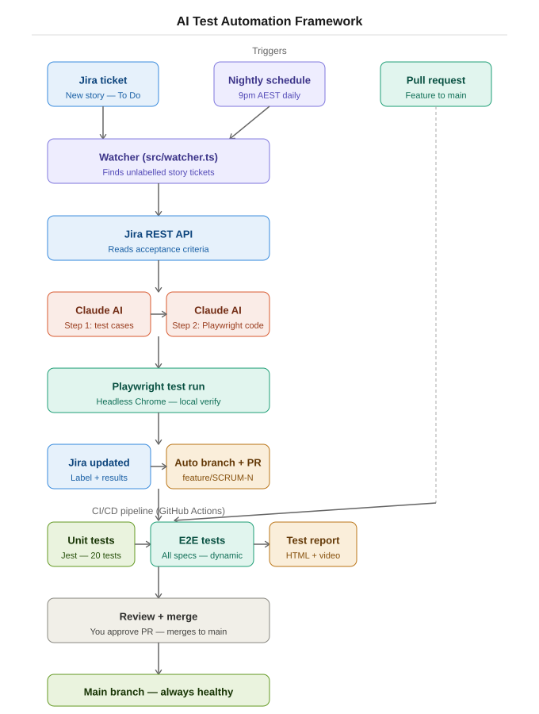

# AI Test Automation Framework

An autonomous QA agent that watches Jira for new story tickets, generates Playwright test cases using Claude AI, runs unit tests and E2E tests in CI/CD, and opens a GitHub PR - all without human intervention.

---

## Architecture

---

## Project structure

    src/
      agent.ts      - AI pipeline: AC to test cases to Playwright code
      watcher.ts    - Orchestrator: polls Jira, runs agent, commits, raises PR
      jira.ts       - Jira REST API client
      index.ts      - CLI entry point for one-shot runs
      codegen.ts    - Wrapper around playwright codegen
      merge.ts      - Merges AI-generated and recorded specs via Claude

    tests/
      TICKET-KEY/   - Auto-generated spec + test-cases.md per Jira ticket

    unit-tests/
      TICKET-KEY/
        TICKET-KEY.test.ts  - Unit tests per ticket

    .github/workflows/
      playwright.yml - CI/CD pipeline

---

## Unit tests

Unit tests validate each page object method in isolation - no browser, no network, runs in milliseconds.

    npx jest --config jest.config.js

Output:

    Test Suites: 1 passed
    Tests:       20 passed
    Time:        0.209s

Unit tests cover:
- goto() - navigates to correct URL
- login() - fills username, password, clicks button in correct order
- goToCart() - clicks cart link, waits for URL
- proceedToCheckout() - clicks checkout, waits for URL
- fillShippingDetails() - fills all three fields, clicks continue
- submitOrder() - waits for step two, clicks finish, waits for complete
- Credential defaults - fallback values are correct

---

## CI/CD pipeline

| Trigger | What runs |
|---|---|
| Pull request to main | Unit tests then E2E tests then report |
| Schedule 21:00 UTC daily | Watcher then unit tests then E2E tests then report |

If unit tests fail - pipeline stops. E2E tests do not run.

---

## Branch strategy

    main (protected)
      - feature/TICKET-KEY  (auto-created by watcher)
      - feature/your-feature  (manual changes)

    Rules:
      - No direct push to main
      - PR required before merge
      - CI/CD must pass before merge

---

## Prerequisites

- Node.js 18+
- Jira project with stories containing acceptance criteria
- Anthropic API key
- GitHub personal access token with repo and workflow scope

---

## Setup

    npm install
    npx playwright install chromium

Create .env file:

    ANTHROPIC_API_KEY=sk-ant-...
    JIRA_BASE_URL=https://your-org.atlassian.net
    JIRA_EMAIL=you@example.com
    JIRA_API_TOKEN=your-jira-api-token
    JIRA_PROJECT=SCRUM
    TEST_WEBSITE_URL=https://www.saucedemo.com
    SAUCE_USERNAME=standard_user
    SAUCE_PASSWORD=secret_sauce
    TOKEN_CUSTOM_GITHUB=ghp_...
    REPO_GITHUB=owner/repo

---

## Usage

Run the watcher manually:

    npx tsx src/watcher.ts

Run for a single Jira ticket:

    npx tsx src/index.ts TICKET-KEY https://your-website.com

Run unit tests:

    npx jest --config jest.config.js

Run all E2E tests:

    npx playwright test tests/

Run a specific spec:

    npx playwright test tests/TICKET-KEY/TICKET-KEY.spec.ts --headed

---

## Tech stack

| Tool | Role |
|---|---|
| Claude claude-sonnet-4-6 | Test case generation and Playwright code generation |
| Playwright | Browser automation and E2E test execution |
| Jest | Unit testing - fast, no browser needed |
| Jira REST API v3 | Read AC, post results, label tickets |
| GitHub API | Create branches, open PRs automatically |
| GitHub Actions | CI/CD - unit tests and E2E on every PR |
| TypeScript + tsx | Language and runtime |
